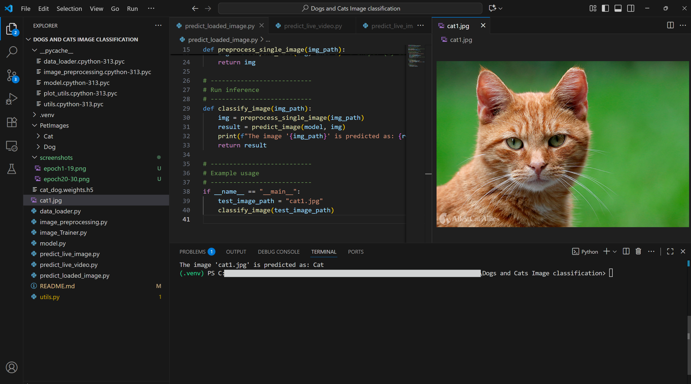

# 🐶🐱 Dogs and Cats Image Classification

## 📖 Overview
This project implements an image classification model to distinguish between **cats** and **dogs**.  
It consists of two main phases: **training** and **testing**.

---

## 🏋️ Phase 1: Training the Model
- **`data_loader.py`** – Loads the dataset from `PetImages` 🗂️
- **`image_preprocessing.py`** – Handles preprocessing of images before training ✨
- **`model.py`** – Contains the architecture of the CNN model used for training 🧠

These modules are imported into **`image_trainer.py`** to train the model.  
The trained weights are stored in **`cat_dog.weights.h5`** 💾

---

## 🧪 Phase 2: Testing the Model
You can test the trained model using three different scripts, based on the weights trained previously.

1. **`predict_loaded_image.py`** 🖼️  
   Loads an image from your machine and predicts whether it is a cat or a dog.

2. **`predict_live_image.py`** 📷  
   Opens your camera, takes a photo, and predicts whether it is a cat or a dog.

3. **`predict_live_video.py`** 🎥  
   Uses your camera feed to continuously predict whether each frame contains a cat or a dog.

---

## 📊 Model Performance
- **Validation Accuracy:** 84.1%  
- **Training Epochs:** 30  

This accuracy was achieved on the validation set after training the model for 30 epochs using the CNN defined in `model.py`.

---

## 📸 Screenshots

### Training Progress
Epochs and validation accuracy over time:

### Model Prediction
Example of the model predicting an image:

---

## Appendix
Source for data set: https://www.microsoft.com/en-us/download/details.aspx?id=54765

